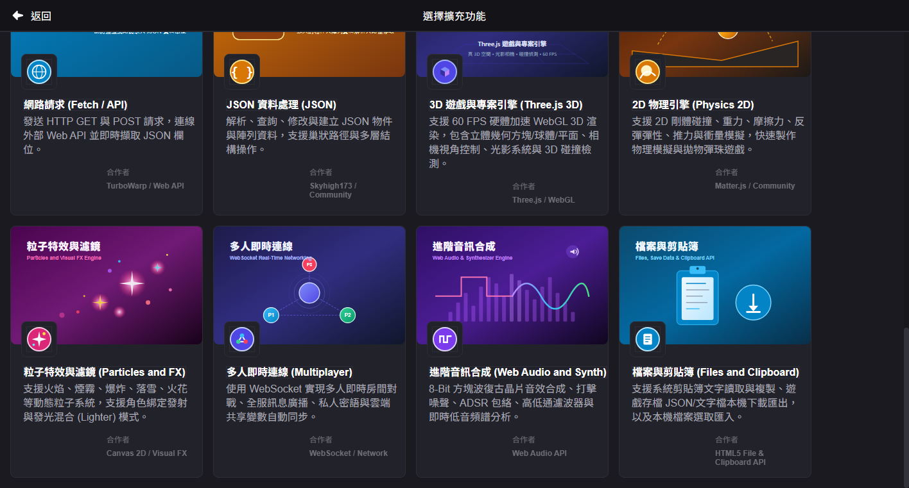
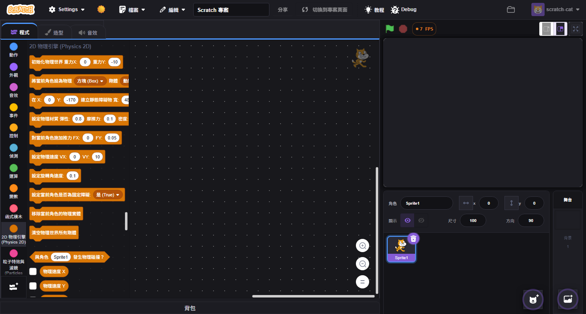

# Scratch 5 大進階擴充模組包 (5-in-1 Extensions Pack) 實裝紀錄

為 Scratch 打造極致豐富的創作生態，依據需求一次性整合 **5 大領域核心進階模組**，大幅拓展遊戲、動畫、音樂、多人連線與資料存儲能力。

---

## 1. 模組功能與積木生態

### (1) 2D 物理引擎 (`physics` / Matter.js)
- **色系**：琥珀金棕色 (`#D97706`)
- **功能特色**：整合 `Matter.js` 剛體物理引擎，支援 2D 剛體碰撞、重力加速度、彈性反彈、摩擦力、空氣阻力與衝量模擬。
- **核心積木**：
  - `[初始化物理世界 重力X: [0] 重力Y: [-10]]`
  - `[將當前角色設為物理 [方塊/圓形] 剛體 [動態/靜態] 寬/直徑: [50] 高: [50]]`
  - `[在 X: [0] Y: [-170] 建立靜態障礙物 寬: [480] 高: [20]]`
  - `[設定物理材質 彈性: [0.8] 摩擦力: [0.1] 密度: [0.001]]`
  - `[對當前角色施加推力 FX: [0] FY: [0.05]]`
  - `[設定物理速度 VX: [0] VY: [10]]`
  - `[設定旋轉角速度: [0.1]]`
  - `<與角色 [Sprite1] 發生物理碰撞？>`
  - 橢圓形回傳積木：`(物理速度 X)`、`(物理速度 Y)`、`(旋轉角速度)`

### (2) 粒子特效與濾鏡 (`particles` / Canvas 2D)
- **色系**：炫光紫粉紅 (`#EC4899`)
- **功能特色**：基於 HTML5 2D Canvas 打造獨立粒子渲染層，具備高效率粒子池、角色跟隨發射器與發光混合模式 (`lighter`)。
- **預設特效**：火焰 (`fire`)、煙霧 (`smoke`)、爆炸震撼 (`explosion`)、飄雪 (`snow`)、火花 (`sparks`)、星光 (`stars`)。
- **核心積木**：
  - `[在 X: [0] Y: [0] 噴射特效 [火焰] 數量: [25]]`
  - `[在當前角色位置噴射特效 [爆炸] 數量: [30]]`
  - `[跟隨當前角色持續發射 [火焰] 頻率: 每秒 [15] 個]`
  - `[自訂粒子 X: [0] Y: [0] 顏色: [#00ffcc] 數量: [20] 速度: [5] 尺寸: [5]]`
  - `[設定粒子色彩混合模式: [加亮光暈 (Lighter) / 正常 (Source-Over) / 濾色 (Screen)]]`
  - `[停止當前角色/所有發射器]`、`[清除畫布上所有粒子]`
  - 橢圓形積木：`(當前活躍粒子數量)`

### (3) 多人即時連線 (`multiplayer` / WebSocket)
- **色系**：連網靛青藍 (`#6366F1`)
- **功能特色**：原生 WebSocket 雙向通訊，支援跨房間訊息廣播、私訊密語、雲端變數同步與自動事件 HAT 觸發。
- **核心積木**：
  - `[連線至伺服器 網址: [wss://...]]`
  - `[加入房間 [game-room-1] 玩家暱稱: [Scratcher]]`
  - `[向全房間廣播訊息 標籤: [chat] 內容: [Hello World!]]`
  - `[私訊玩家 [p_123456] 標籤: [private] 內容: [Hi!]]`
  - `[同步房間變數 [score] 為 [100]]`
  - `[當收到連線訊息 標籤: [chat]]` (HAT 觸發積木)
  - 橢圓形積木：`(我的玩家 ID)`、`(我的玩家暱稱)`、`(當前房間名稱)`、`(最新收到的訊息內容)`、`(取得房間變數 [KEY])`
  - 布林積木：`<已成功連線？>`、`<已在房間中？>`

### (4) 進階音訊合成 (`webaudio` / Web Audio API)
- **色系**：合成器紫羅蘭 (`#8B5CF6`)
- **功能特色**：採用原生 Web Audio API，具備 8-Bit 復古晶片方塊波合成、打擊噪聲/雷射音效、ADSR 包絡、高低通濾波器與即時低音/音量頻譜分析。
- **核心積木**：
  - `[播放合成音調 波形: [方塊波 (8-Bit) / 正弦波 / 三角波 / 鋸齒波] 音高: [440] Hz 時間: [0.3] 秒]`
  - `[演奏音符 [C4] 波形: [三角波] 持續: [0.4] 秒]`
  - `[播放噪聲打擊/爆炸音效 類型: [爆炸震撼 / 復古打擊鼓 / 雷射光束 / 白噪音] 持續: [0.25] 秒]`
  - `[設定 ADSR 包絡 起音(A): [0.05] 衰減(D): [0.1] 延音(S): [0.7] 釋音(R): [0.2]]`
  - `[設定音效濾波器 模式: [低通濾波 / 高通濾波 / 帶通濾波] 截止頻率: [1200] Hz 諧振(Q): [2]]`
  - 橢圓形回傳積木：`(即時低音能量 (0-100))`、`(即時音量輸出水平 (0-100))`、`(即時音訊主頻率 (Hz))`

### (5) 檔案與剪貼簿 (`files` / File & Clipboard API)
- **色系**：天藍雲朵色 (`#0EA5E9`)
- **功能特色**：原生 HTML5 File API 與系統剪貼簿 API，支援本地遊戲存檔下載匯出、本地關卡/地圖檔案匯入，以及系統剪貼簿複製貼上。
- **核心積木**：
  - `[複製文字 [TEXT] 到系統剪貼簿]`
  - `[讀取系統剪貼簿內容]`
  - `(當前剪貼簿文字)`
  - `[下載/儲存檔案 檔名: [savegame.json] 內容: [JSON文字]]`
  - `[彈出檔案選取視窗 支援類型: [.json,.txt,.csv]]`
  - `<已成功讀取檔案？>`
  - 橢圓形積木：`(讀取的檔案內容)`、`(讀取的檔案名稱)`、`(讀取的檔案大小 (Bytes))`

---

## 2. 實機渲染與自動化測試驗證

### (1) 擴充庫選單卡片展示
點擊 Scratch 左下角「**+ 新增擴充**」按鈕，5 大模組卡片完整展示：

### (2) 積木工具箱與編程畫布
載入後各模組具備專屬色彩圓形圖標與全套繁體中文積木：

---

## 3. 線上部署與體驗網址

- **GitHub Pages 網址**：[https://o-o1112.github.io/scratch-gui/](https://o-o1112.github.io/scratch-gui/)
- **GitHub 專案原始碼**：[https://github.com/O-O1112/scratch-gui](https://github.com/O-O1112/scratch-gui)
- **使用方式**：點擊左下角「**+ 新增擴充**」，即可直接選用 **2D 物理引擎**、**粒子特效與濾鏡**、**多人即時連線**、**進階音訊合成**、**檔案與剪貼簿**！
